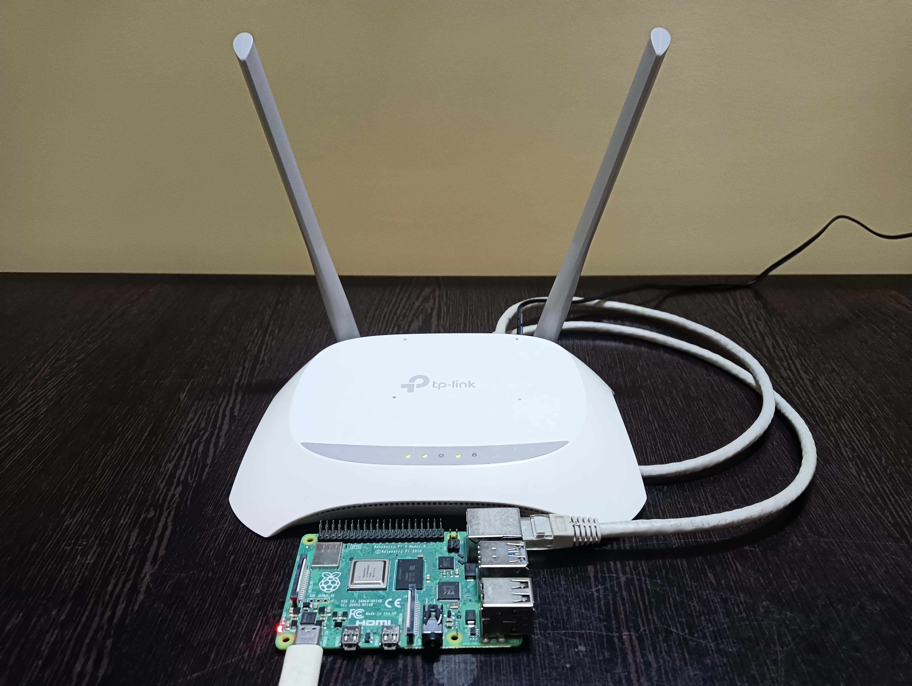
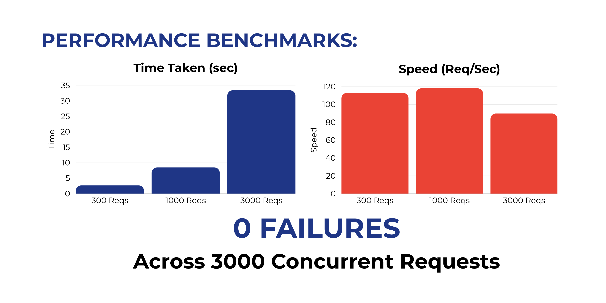
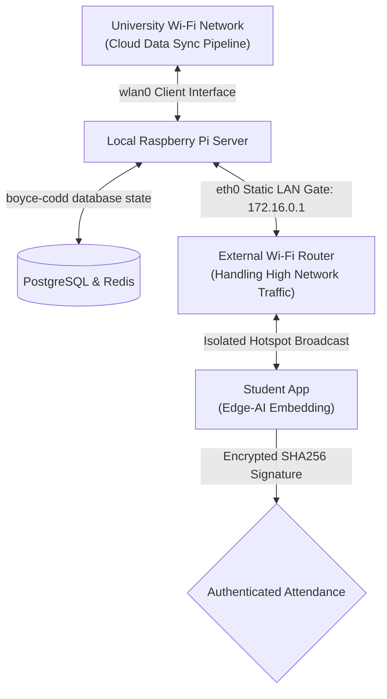

# ZeroProxy: Smart Attendance & Edge-AI Ecosystem

  

ZeroProxy is an end-to-end, high-concurrency hardware-software ecosystem designed as a solo initiative to eliminate proxy attendance in large institutional environments. By combining discrete technologies—including edge computing, local networking, cross-platform mobile architecture, and localized machine learning—the system drastically optimizes operational workflows. 

### ⚡ The Impact
* **Speed Efficiency:** Processes authentication for a **150-student class in roughly 3 minutes**, replacing traditional fingerprint scanning methods that average up to 30 minutes.
* **Gamified Anti-Spoofing:** Defeats photo and video attacks using interactive liveness detection. Users control a "Fruit Catcher" game via real-time head tracking, while a background AI model continuously validates their biometric identity.
* **Smart Resource Scaling:** Offloads heavy biometric vectorization to client edge-devices, allowing a low-powered, cost-effective Raspberry Pi to seamlessly handle massive concurrent request spikes without server-side performance degradation.

---

### Image:

  

---

## 📂 System Component Directory

The complete ZeroProxy ecosystem is split into three distinct, specialized codebases built with Feature-First Architecture. Navigate to the respective repositories below to view the source code and localized documentation:

* [**ZeroProxy Backend Server**](https://github.com/Prince-Patel84/zeroproxy-server)
  * **Core Tech:** Node.js, PostgreSQL (BCNF Normalized), Redis Cache, Bash Shell Scripting, Nodemailer (SMTP).
  * **Role:** The local network gateway on a Raspberry Pi. It manages strict database states, loads active sessions into lightning-fast Redis cache, handles real-time Socket.IO session tracking, and automates daily university cloud syncing via the Google Sheets API.

* [**ZeroProxy Student Mobile App**](https://github.com/Prince-Patel84/zeroproxy-student-app)
  * **Core Tech:** Flutter, Dart, TFLite (FaceNet model), Google ML Kit, Cryptography (SHA-256).
  * **Role:** Enforces physical environment checks (Wi-Fi, Bluetooth, Mobile Data) on client hardware. Executes the gamified liveness detection loop, generating 512-dimensional vector face embeddings on-device to continuously verify identity via Cosine Similarity, and signs requests with an anti-spoofing cryptographic BSSID signature.

* [**ZeroProxy Admin Mobile App**](https://github.com/Prince-Patel84/zeroproxy-admin-app)
  * **Core Tech:** Flutter, Dart, Secure HTTP Client Pinning, Native File Dialogs.
  * **Role:** Help Attendance Staff to register students (triggering automated credential emails), start attendance sessions, monitor real-time attendance marking, and export the day's attendance directly to Google Sheets with a single click.

---

## [**To Watch The Demo Click Here.**](https://youtu.be/gKqsvI6S5E4?si=dC2S-zePrRjLOObu&t=162)

---

  

---
## 🛠️ Integrated Systems Architecture

ZeroProxy derives its value by integrating totally different components that cannot solve the problem on their own, transforming them into a unified, high-security problem-solving engine:

